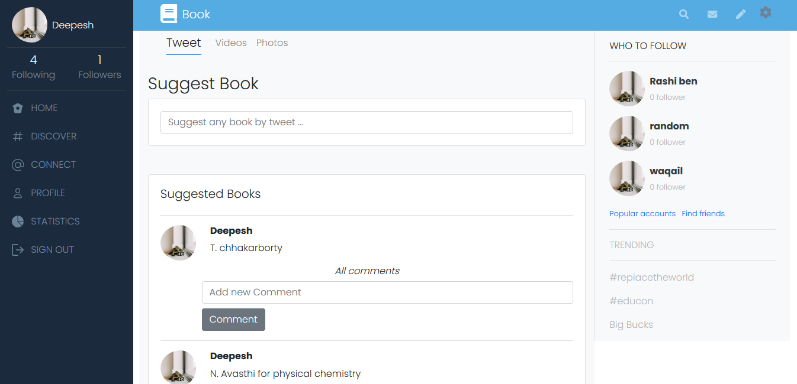

# Rails [Twitter-Redesign: Food Mart Hub].

This project is build for the Ruby on Rails capstone which is based on a redesign of Twitter. It's a real-world-like project, built with business specifications. [Find project specifications here](https://www.notion.so/Rails-Capstone-project-Twitter-Redesign-ebd18948247d447293f5894a4ea5b393)
      

<div align="center">

[](https://github.com/Dipeshtwis/twitter-redesign)
[](https://github.com/Dipeshtwis/twitter-redesign/issues)
[](https://github.com/Dipeshtwis/twitter-redesign/pulls)

</div>

## 📝 Contents

<p align="center">
<a href="#with">Built with</a>&nbsp;&nbsp;&nbsp;|&nbsp;&nbsp;&nbsp;
<a href="#sc">Screenshot</a>&nbsp;&nbsp;&nbsp;|&nbsp;&nbsp;&nbsp;
<a href="#ll">Live Demo Link</a>&nbsp;&nbsp;&nbsp;|&nbsp;&nbsp;&nbsp;
<a href="#gs">Getting started</a>&nbsp;&nbsp;&nbsp;|&nbsp;&nbsp;&nbsp;
<a href="#author">Author</a>
</p>


># [Capstone Description]
>Capstone projects are solo projects at the end of the each of the Microverse Main Technical Curriculum sections. Building this project is very important for you because

- It's a real-world-like project, built with business specifications that will look really nice in your portfolio; and
- You will get feedback about the achievement of technical and soft skills gained during this section of the program.

The project you are going to build for the Ruby on Rails capstone is based on a redesign of Twitter. You should follow the given design of the website, but you must personalize the content, i.e., it can be an app to share opinions about books, wedding business, fishing equipment, mushrooms - anything that you can share opinions about with people who follow you. Feel free to add your own app name and logo.

## 🔧 Built with<a name = "with"></a>

- Ruby on Rails (Version: 6.0.3.2)
- Ruby (Version: 3.0.0)
- Postgresql (version: 12)
- [Rspec](https://relishapp.com/rspec/rspec-rails/docs/model-specs)
- [Capybara](https://www.codewithjason.com/rails-testing-hello-world-using-rspec-capybara/)
- [Active Storage](https://www.microverse.org/blog/how-to-build-an-image-upload-feature-with-rails-and-active-storage)
- Ruby on Rails
- webpack
- Heroku
- Sqlite
- Postgres
- MVC pattern
- Node.js
- Yarn

## Getting Started <a name = "gs"></a>
> To get a local copy up and running follow these simple example steps.

<details>
  <summary>Get instructions</summary>

```
$ cd <folder>
```

~~~bash
$ git clone https://github.com/errea/Food-Hub-Mart-Twitter_Redesign.git
$ cd twitter-redesign
$ bundle install
$ yarn install --check-files
~~~

Setup database with:

> make sure you have postgres sql installed and running on your local machine

> Go to config > database.yml

Replace ```xxx``` with your ```own``` postgresql username and password
```
username: xxx
password: xxx
```

> create and migrate the database by these commands

```
   rails db:create
   rails db:migrate
```

### How to run

Start server with:

```
$ rails s
```

Open `http://localhost:3000/` in your browser.


## To run Test

~~~ruby
$ rails db:migrate RAILS_ENV=test
$ rspec --format documentation

~~~
  Then, install the needed gems:
  ```ruby
  $ bundle install --without production
  ```
  Next, migrate the database:
  ```ruby
  $ rails db:migrate
  ```
  If you want to load sample users and events, use seeds:
  ```ruby
  $ rails db:seed
  ```
</details> 


## Set up
* Open your terminal and locate the folder you want to clone the repository and follow the steps below to install

## Install

Run the following command into your terminal:

```console
run bundle install 

run rails db:migrate to migrate files
```

## Project Structure

    ├── README.md
    ├── bundle
    │   └── main.rb
    └── .github\workflows
        └── linters.yml
    └── app
        └── assets
        └── channels
        └── controllers
        └── helpers
        └── jobs
        └── mailers
        └── models
        └── views    
    └── bin
    └── config
    └── db
    └──log
    └── bin
    └── public
    └── storage
    └──test

## Live Demo Link <a name = "ll"></a>

[Live Demo](https://bookhelpy.herokuapp.com)

## Deployment
1) Git clone this repo and cd the to the `private_events` directory.
2) Run `rails server` in command line to open the application server in your browser via http://localhost:3000 or something similar
3) Run `heroku start`.
4) heroku run
5) heroku run rails db:migrate
6) git push heroku main
7) heroku run console

## Functionality

Logged in users can create, edit, and follow/unfollow other users. Users can change their RSVPs to upcoming invitations, but not to past ones.

1. The user logs in to the app, only by typing the username (a proper authenticated login is **not** a requirement).
2. The user is presented with the homepage (see the *Homepage* screenshot above) that includes:
    1. Left-side menu (includes only links to pages that are implemented).
    2. *Tweets* tab in the centre (skip *Photos* and *Videos* for this MVP).
    3. Right-side section with *Who to follow (*skip *Trending for* this MVP).
3. The *Tweets* section includes:
    1. Simple form for creating a tweet.
    2. List of all tweets (sorted by most recent) that display tweet text and author details.
4. The *Who to follow* section includes:
    1. List of profiles that are not followed by the logged-in user (ordered by most recently added).
5. When the user opens the profile page (see the *Userpage* screenshot above), they can see:
    1. Left-side menu (includes only links to pages that are implemented).
    2. Cover picture and *Tweets* tab in the centre (skip other tabs and *Tweet to user* form).
    3. Right-side section with *Profile detailed info.*
6. The *Profile detailed info* section includes:
    1. User photo.
    2. Button to follow a user.
    3. Stats: total number of tweets, number of followers and number of following users.
    4. List of people who follow this user.
7. At the end extend your MVP app with one simple feature of your choice.

## Thoughts

One of the main challenges I encountered /ran into was deciding how to upload pictures to the application

```ruby
User.order(:username).includes(:invitations).each do |user|
{ checked: user.invitations.any? { |inv| inv.event_id == @event.id } } # Ruby; no index
  
User.order(:username).includes(:invitations).each do |user|
{ checked: user.invitations.exists?(event: @event) } # n+1 query
  
User.all.order(:username)
  .includes(:invitations)
  .where('invitations.event_id = ?', @event.id)
  .references(:invitations).each #where clause filters users, not invitations

{ checked: @event.invitations.exists?(recipient_id: user.id) }) # n+1 query

{ checked: @event.invitations.any? { |inv| inv.recipient_id == user.id } } # Ruby; no index

temp_invitations = @event.invitations.pluck(:recipient_id)
{ checked: !!temp_invitations.delete(user.id) } # much faster than anything else I tried

```

Our eventual solution has the advantages of only making one query, storing a relatively lightweight array of `recipient_id` integers, and diminishing average search times as found elements are deleted from the array. It was much faster than any alternative I tried. Still, it doesn't feel like the most elegant solution.

##### Testing

We wrote tests for `spec/controllers/events_controller_spec.rb`, and  `spec/models/*` using the `shoulda-matchers`, `rails-controller-testing`, and `factory-bot-rails` gems. In projects where I wrote my own authorization I had been using this helper method to stub methods related to authentication:

```ruby
def login(user)
  allow_any_instance_of(ApplicationController).to receive(:current_user) { user }
  allow_any_instance_of(ApplicationController).to receive(:authenticate_user!).and_return(true)
end
```

With Devise, however, I just needed to add these lines to `spec/rails_helper.rb`:

```ruby
config.include Devise::Test::IntegrationHelpers, type: :request
config.include Devise::Test::ControllerHelpers, type: :view
config.include Devise::Test::ControllerHelpers, type: :controller
```

Because `rspec-rails` was already bundled when I generated the `Event` scaffolding, a bunch of tests were generated in the `spec` folder. I decided to look into these and make them pass as well since they contained techniques I hadn't seen before.

I didn't encounter too many snags here, but getting syntax that worked for stuff like `assert_select "div", /Nov 11 2022 12:00am/, count: 1` in the view specs took me a while. 


```


## Screenshot <a name = "sc"></a>

### Home Page



### Profile Page


## Reflection

This was an awesome rundown practice and I had a really joyful fun playing with associations, until I bumped into extra credit on allowance to invite other users.

<details>
  <summary>Spoiler alert! Click to continue reading...</summary>

  In the beginning, I added an `Invitations` model to my app, because in real world `invitation` and `enrollment` are two conceptually different things. And I made it work with this setup. IMHO, two join models looked very similar:
  ```ruby
  class Enrollment < ApplicationRecord
    belongs_to :event
    belongs_to :user
  end
  class Invitation < ApplicationRecord
    belongs_to :event
    belongs_to :host, class_name: "User"
    belongs_to :invitee, class_name: "User"
  end
  ```
  So, I decided to go with one model, got rid off `Invitations` and put everything in `Enrollment`.
  ```ruby
  class Enrollment < ApplicationRecord
    belongs_to :event
    belongs_to :user
    belongs_to :host, class_name: "User"
    belongs_to :invitee, class_name: "User"
  end
  ```
  As far as `User` invites other `User`, it felt right to apply self joins, so I created something like
  ```ruby
  class User < ApplicationRecord
    has_many :events
    has_many :enrollments
    has_many :attended_events, through: :enrollments, source: :event
    
    has_many :invited_users, foreign_key: "host_id", class_name: 'Enrollment'
    has_many :invitees, through: :invited_users
    has_many :hosting_users, foreign_key: "invitee_id", class_name: 'Enrollment'
    has_many :hosts, through: :hosting_users
  end
  ```
  And to my surprise associations were working! As far I got rid off `Invitation` controller I had no idea on how to split `enrollment` and `invitation` creation, what routes to use, etc. At this point I tried different things and finished asking support to the forum. @GopherJackets was really helpful in the understanding of my model set up and cleaning it up. Then the conversation with @nalyk inspired me to find an interesting solution: when a creator of the event sends an invitation, it triggers the creation of a new `enrollment` joining only `invitee_id` and `event_id` (I had to set `user_id` as `optional` to make it work). When the invited user accepts the invite by enrolling to the event, it was updating an existing `enrollment` with his `id` in `user_id` column. The only issue was on how to drop an enrollment without canceling the invitation. And here I had an eye-opening talk with @Roli who not only explained how to fix the bug, but helped me polish completely the app and adviced to use `enum status`, which makes the extra task super easy. You're seeing the final result of Data model.

  A couple of interesting articles on `enum` are [here](https://sipsandbits.com/2018/04/30/using-database-native-enums-with-rails/) and [here](https://naturaily.com/blog/ruby-on-rails-enum).

</details>  

## ✒️  Authors <a name = "author"></a>

👤 **Eri**

- Github: [@errea](https://github.com/errea)
- Twitter: [@Erreakay](https://github.com/errea)
- Linkedin: [Eri Okereafor](https://www.linkedin.com/in/eri-ngozi-okereafor/)
  
## 🤝 Contributing

Contributions, issues and feature requests are welcome!

Feel free to check the [issues page](https://github.com/Mihndim2020/Private-Events/issues).

## 👍 Show your support

Give a ⭐️ if you like this project!
- Design Idea by: [Gregoire Vella](https://www.behance.net/gregoirevella)

- Microverse: [@microverse](https://www.microverse.org/)

## Acknowledgments

- Microverse

## 📝 License

This project is [MIT](./MIT.md) licensed.


